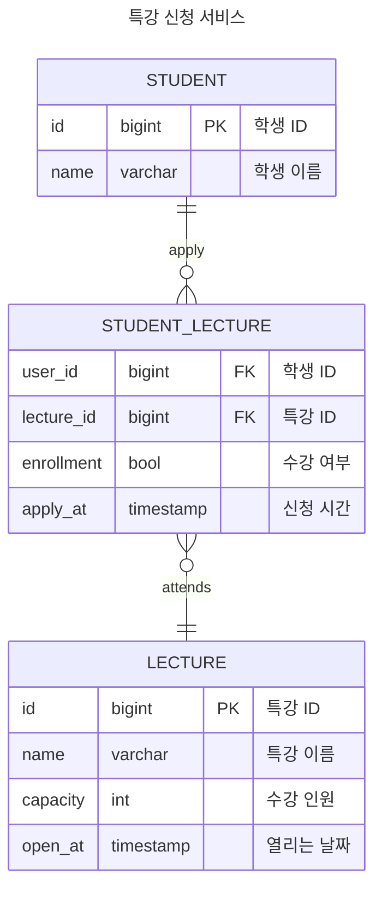

## Description

- `특강 신청 서비스`를 구현해 봅니다.
- 항해 플러스 토요일 특강을 신청할 수 있는 서비스를 개발합니다.
- 특강 신청 및 신청자 목록 관리를 RDBMS를 이용해 관리할 방법을 고민합니다.
## Requirements
- ERD 작성 및 당위성 증명합니다.
- 아래 3가지 API 를 구현합니다.
  - 특강 신청 API
  - 특강 신청 여부 조회 API
  - 특강 목록 조회 API
- 각 기능 및 제약 사항에 대해 단위 테스트를 반드시 하나 이상 작성하도록 합니다.
- 다수의 인스턴스로 어플리케이션이 동작하더라도 기능에 문제가 없도록 작성하도록 합니다.
- 동시성 이슈를 고려하여 구현합니다.

---

## Entity Relationship Diagram

최대한 적은 테이블과 필드 개수로 설계 했습니다.
- 장점
  - 데이터 중복 최소화
    - 각 학생과 특강 정보는 별도의 테이블에 저장되어 중복을 최소화 합니다.
      - 저장 공간 절약
        - 중복 데이터가 없으므로 저장 공간을 절약할 수 있습니다.
  - 데이터 무결성 유지
    - 외래 키를 사용하여 학생과 특강 간의 관계를 유지해 데이터 무결성을 보장합니다.
  - 유연성과 확장성
    - 새로운 학생 / 특강이 추가 될 때 새로운 관계를 추가함으로써 확장 가능 합니다.
- 단점
  - 쿼리 복잡성
    -  단순한 쿼리보다 조인을 사용해야 하므로 쿼리 복잡성이 증가 합니다.
  - 동시성 문제
    - ~~여러 트랜잭션이 중간테이블에 동시에 삽입/삭제/업데이트 시 일관성 유지 어려움~~
      - 현재 명세에서는 학생이 특강을 취소하는 경우를 고려하지 않았습니다. 현재 구조는 삽입만을 고려합니다.

이 설계는 데이터의 중복을 최소화하고 저장 공간을 절약하며
데이터 무결성을 유지하는 데 강점을 가지고 있지만 취소 기능을 고려할 경우
추가적인 설계가 필요합니다.

## Note
✅TEST : Add 'LectureControllerTest' for applyLecture feature
✨FEAT : Implement `LectureController` `applyLecture` method
- `ApplyLectureCommand`DTO로 Service Layer 전달.
- `ApplyLectureAPIResponse`로 응답값을 매핑.
- `ApplyLectureUseCase`의 구현체를 어떻게 네이밍 할지 고민.
  - `ApplyLectureService` or `ApplyLectureUseCaseImpl`

✅TEST : Add 'ApplyLectureServiceTest'
- ~~결국 `ApplyLectureService`로 결정~~. Service가 UseCase의 상위 모듈이 아닌데, 상호 보완적인 관계라서 구현체라고 해야할지 잘 모르겠다.

🎨REFACTOR : Add `LectureService` to handle the application logic and interact with `ApplyLectureUseCase`
- 추후 서비스 될 수 있는 기능을 `UseCase`에 추가하고 실제로 서비스 되는 기능을 `Service`에 추가하는 설계(?).

✨FEAT : Update concurrency for applyLecture execute
-  when(lectureRepository.findById(lectureId)).thenReturn(Optional.of(lecture))
   이미 appyLecture 메서드를 호출하기 전에 리턴 대상(`Optional.of(lecture)`)을 지정해주는데
   어떻게 applyLecutureUseCase 내에서 수강인원이 줄어드는 lecture를 리턴하는 걸까?

🔬SCOPE : Update concurrency for applyLecture execute using pessimistic locking
- 메서드에서 임계 구간을 지정하기 보다 JPA 어노테이션으로 비관락을 설정.

🎨 REFACTOR: Implement repositories to adhere to OCP and DIP
- `Repository`의 OCP와 DIP를 지키기 위해, 다른 형태의 Repository도 JPA와 같은 메서드 명을 가져야 하는걸까?

✨FEAT : Add feature to list lectures
- 특강 목록 API 추가

✨FEAT : Add feature to check lecture enrollment and its test code
- 특강 신청 (완료) 여부 조회 API 추가
  - `student_id`로 `student_lecture` 테이블을 조회하여 enrollment 값이 true인 Entity 필터링.
    - 사용자가 특강 신청 한개라도 성공한다면 true 리턴.
  - 확장성을 고려하여 단순히 true/false를 리턴하는 대신 ~~CheckLectureEnrollmentAPIResponse~~`EnrolledLectureAPIResponse`를 리턴.
    - 사용자가 특강 신청 성공한 특강 목록 리턴.
    - 사용자가 특강 신청한 모든 특강 목록 리턴.
    - @RequestParam을 추가하여 `lecture_id`를 받아 특정 특강 신청 성공 여부 리턴.

TBD :
동시성 제어 테스트
- 분산 환경에도 동시성 제어 하기 위해 Repository Layer에서 락을 해줘야 함.
- 일단 JPA Repository 인터페이스 메서드가 익숙치 않아, 의도대로 동작을 하는지 확인.
- JPA Repository 메서드에 비관적 락을 걸어보자.