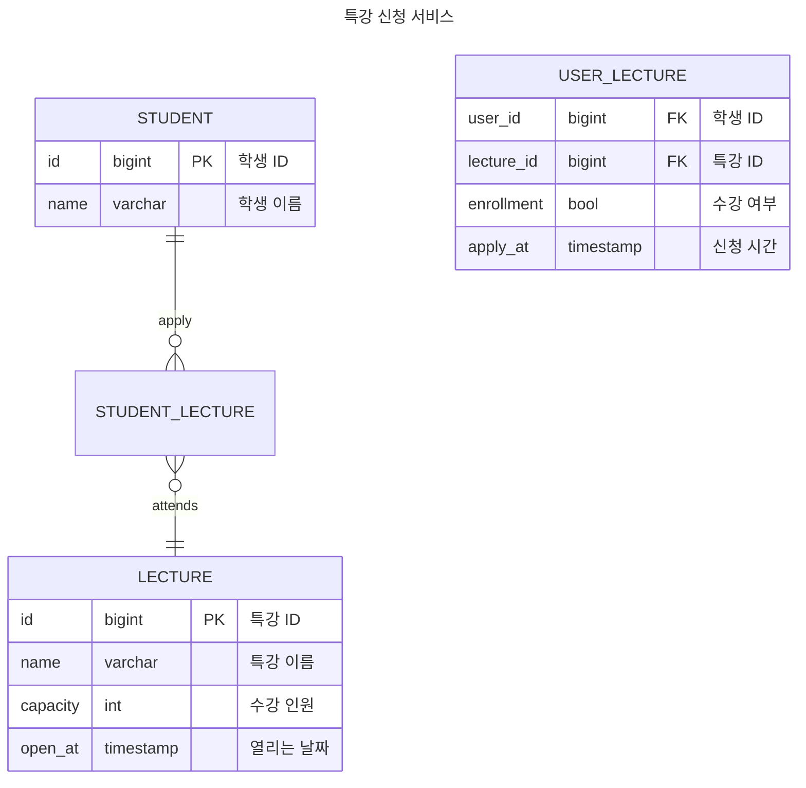

## Description

- `특강 신청 서비스`를 구현해 봅니다.
- 항해 플러스 토요일 특강을 신청할 수 있는 서비스를 개발합니다.
- 특강 신청 및 신청자 목록 관리를 RDBMS를 이용해 관리할 방법을 고민합니다.

## Requirements

- 아래 2가지 API 를 구현합니다.
    - 특강 신청 API
    - 특강 신청 여부 조회 API
- 각 기능 및 제약 사항에 대해 단위 테스트를 반드시 하나 이상 작성하도록 합니다.
- 다수의 인스턴스로 어플리케이션이 동작하더라도 기능에 문제가 없도록 작성하도록 합니다.
- 동시성 이슈를 고려하여 구현합니다.

## API Specs

1️⃣ **(핵심)** 특강 신청 **API `POST /lectures/apply`**

- 특정 userId 로 선착순으로 제공되는 특강을 신청하는 API 를 작성합니다.
- 동일한 신청자는 한 번의 수강 신청만 성공할 수 있습니다.
- 특강은 `4월 20일 토요일 1시` 에 열리며, 선착순 30명만 신청 가능합니다.
- 이미 신청자가 30명이 초과되면 이후 신청자는 요청을 실패합니다.
- 어떤 유저가 특강을 신청했는지 히스토리를 저장해야한다.

**2️⃣ (기본)** 특강 신청 완료 여부 조회 API **`GET /lectures/application/{userId}`**

- 특정 userId 로 특강 신청 완료 여부를 조회하는 API 를 작성합니다.
- 특강 신청에 성공한 사용자는 성공했음을, 특강 등록자 명단에 없는 사용자는 실패했음을 반환합니다. (true, false)

---

### 심화 과제

3️⃣ **(필수) 특강 선택 API `GET /lectures`**

- 단 한번의 특강을 위한 것이 아닌 날짜별로 특강이 존재할 수 있는 범용적인 서비스로 변화시켜 봅니다.
- 이를 수용하기 위해, 특강 엔티티의 경우 기존의 설계에서 변경되어야 합니다.
- 특강의 정원은 30명으로 고정이며, 사용자는 각 특강에 신청하기전 목록을 조회해볼 수 있어야 합니다.
    - 추가로 정원이 특강마다 다르다면 어떻게 처리할것인가..? 고민해 보셔라~

<aside>
💡 **KEY POINT**

</aside>

- 정확하게 30명의 사용자에게만 특강을 제공할 방법을 고민해 봅니다.
- 같은 사용자에게 여러 번의 특강 슬롯이 제공되지 않도록 제한할 방법을 고민해 봅니다.

---

## Entity Relationship Diagram

최대한 적은 테이블과 필드 개수로 설계 했습니다.
- 장점
  - 데이터 중복 최소화
    - 저장 공간 절약
  - 데이터 무결성 유지
    - 외래 키 사용
  - 유연성과 확장성
    - 새로운 학생 / 특강이 추가 될 때 새로운 관계를 추가함으로써 확장 가능
- 단점
  - 쿼리 복잡성
    -  단순한 쿼리보다 조인을 사용해야 하므로 쿼리 복잡성이 증가
  - 동시성 문제
    - ~~여러 트랜잭션이 중간테이블에 동시에 삽입/삭제/업데이트 시 일관성 유지 어려움~~
      - 명세에서는 학생이 특강을 취소하는 경우를 고려하지 않음
      - 삽입만 고려하면 됨
## Note
✅TEST : Add 'LectureControllerTest' for applyLecture feature
✨FEAT : Implement `LectureController` `applyLecture` method
- `ApplyLectureCommand`DTO로 Service Layer 전달.
- `ApplyLectureAPIResponse`로 응답값을 매핑.
- `ApplyLectureUseCase`의 구현체를 어떻게 네이밍 할지 고민.
  - `ApplyLectureService` or `ApplyLectureUseCaseImpl`

✅TEST : Add 'ApplyLectureServiceTest'
- 결국 `ApplyLectureService`로 결정.

🎨REFACTOR : Add `LectureService` to handle the application logic and interact with `ApplyLectureUseCase`
- 추후 서비스 될 수 있는 기능을 `UseCase`에 추가하고 실제로 서비스 되는 기능을 `Service`에 추가하는 설계(?).

✨FEAT : Update concurrency for applyLecture execute
-  when(lectureRepository.findById(lectureId)).thenReturn(Optional.of(lecture))
  이미 appyLecture 메서드를 호출하기 전에 리턴 대상(`Optional.of(lecture)`)을 지정해주는데
  어떻게 applyLecutureUseCase 내에서 수강인원이 줄어드는 lecture를 리턴하는 걸까?

🔬SCOPE : Update concurrency for applyLecture execute using pessimistic locking
- 메서드에서 임계 구간을 지정하기 보다 JPA 어노테이션으로 비관락을 설정.